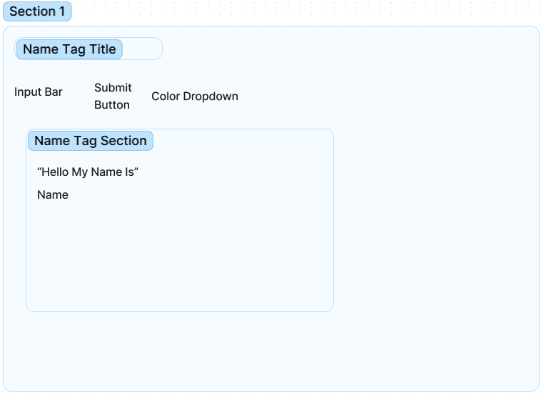

# Name Tag Page

# State

1. display of the name
2. name tag color

# Events

1. input field
2. submit name button
3. color selector dropdown

# HTML

<section>
-<h1>Hello! My name is</h1>
-<input />
-<button></button>
-<select></select>
</section>

<section>
-<h1>Hello, my name is </h1>
-
Name

</section>

1. display name
2. 
